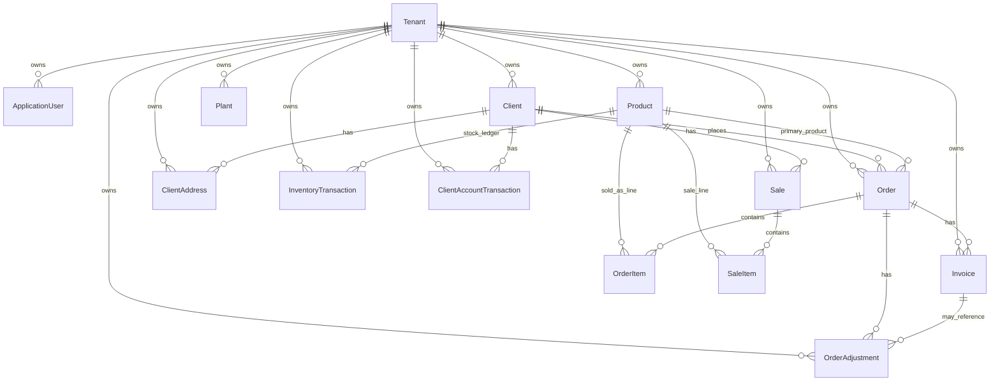

# Data Model

Status labels used in this document: **Confirmed**, **Partial**, **Missing**, **Legacy**, **Unverified**.

This document describes the current database model as it exists today. FreshMooz is the only active store for the current launch phase.

## Current tenancy approach

- **Confirmed:** FreshMooz is the only active tenant for this launch phase.
- **Confirmed:** Existing `TenantId` fields remain in place.
- **Deferred:** Strict domain-based tenant resolution, composite tenant foreign keys, and multi-store administration are deferred.
- **Required:** Public requests must still use a server-controlled FreshMooz tenant rather than accepting arbitrary tenant selection.
- **Planned:** Multi-tenant hardening will be revisited after FreshMooz checkout, payments, orders, and reporting are stable.

## Main entities grouped by domain

### Tenancy

| Entity | Status | Purpose |
|---|---|---|
| `Tenant` | Confirmed | Store/tenant record. Current seeded tenant is FreshMooz. |

### Identity and access

| Entity | Status | Purpose |
|---|---|---|
| `ApplicationUser` | Confirmed | ASP.NET Identity user extended with name, role, active flag, tenant id, timestamps. |
| Identity tables | Confirmed | ASP.NET Identity roles, claims, logins, tokens, user-role relationships. |
| `User` | Legacy | Separate non-Identity user model. Its active role is unclear. |

### Catalogue and inventory

| Entity | Status | Purpose |
|---|---|---|
| `Product` | Confirmed | Product master record with SKU, price, cost price, quantity, type, unit, image file name, loose quantity flag, active flag, tenant id. |
| `InventoryTransaction` | Confirmed | Stock movement ledger with product, quantity delta, reason, reference, effective date, created user, tenant id. |
| `Plant` | Partial | Tenant-owned plant/location record. No strong confirmed relationship to inventory or orders. |

### Customers

| Entity | Status | Purpose |
|---|---|---|
| `Client` | Confirmed | Customer/client profile with name, email, phone, type, credit limit, totals, tenant id, optional user id. |
| `ClientAddress` | Confirmed | Customer/user address record with label, default flag, name, phone, address fields, tenant id. |
| `ClientAccountTransaction` | Confirmed | Customer credit/advance/refund/adjustment ledger. |

### Orders

| Entity | Status | Purpose |
|---|---|---|
| `Order` | Confirmed | Order header with order number, client, primary product fields, totals, status, payment method, invoice status, shipping snapshot, tenant id. |
| `OrderItem` | Confirmed | Multi-line order item with product, quantity, unit price, discount amount, tenant id. |
| `OrderAdjustment` | Confirmed | Discount/credit-note/adjustment record tied to an order and optionally an invoice. |

### Invoices and payments

| Entity | Status | Purpose |
|---|---|---|
| `Invoice` | Partial | Used for automatic unpaid invoices and paid payment records. A separate payment entity does not exist. |

### Legacy sales

| Entity | Status | Purpose |
|---|---|---|
| `Sale` | Legacy | Older sale record with invoice number, subtotal/tax/discount/total, payment status/method, paid/remaining amount. |
| `SaleItem` | Legacy | Older sale line item tied to sale and product. |
| `SalesAnalysis` | Legacy | Non-persisted analysis/result model. |

## Important relationships

Notes:

- **Confirmed:** `Order` has required relationships to `Client` and `Product`.
- **Confirmed:** `OrderItem` has required relationships to `Order` and `Product`.
- **Confirmed:** `Invoice` belongs to `Order`.
- **Confirmed:** `InventoryTransaction` belongs to `Product`.
- **Confirmed:** `ClientAddress` can belong to `Client`; it also stores optional `UserId`.
- **Partial:** Tenant ownership is represented by `TenantId` on many entities, but not consistently enforced through composite tenant foreign keys.

## Current product and inventory model

### Product

Status: **Partial**

Current fields include:

- `Id`
- `Name`
- `Description`
- `SKU`
- `Price`
- `CostPrice`
- `Quantity`
- `Type`
- `Unit`
- `ImageFileName`
- `IsLooseQuantity`
- `IsActive`
- `TenantId`
- timestamps

Current behavior:

- **Confirmed:** Product price uses decimal precision `18,2`.
- **Confirmed:** Product quantity uses decimal precision `18,3`.
- **Confirmed:** Product active/archive behavior exists through `IsActive`.
- **Confirmed:** Loose quantity support exists through `IsLooseQuantity`.
- **Missing:** Category model.
- **Missing:** Product variant model.
- **Missing:** Stable product slug.
- **Missing:** Product image gallery and alt text model.
- **Missing:** Tenant-scoped unique SKU constraint.

### Inventory

Status: **Partial**

Current inventory model:

- Product has current stock in `Product.Quantity`.
- Inventory changes are recorded in `InventoryTransaction`.
- Inventory transaction fields include tenant, product, quantity delta, reason, reference type/id, note, effective date, created timestamp, created user.

Current behavior:

- **Confirmed:** Stock deduction is performed during order creation.
- **Confirmed:** Order cancellation restores stock.
- **Confirmed:** Inventory transactions are created when stock is adjusted.
- **Partial:** Stock safety is service-managed.
- **Missing:** Database-level stock concurrency protection.
- **Missing:** Database check constraint preventing invalid stock values.
- **Missing:** Multi-location or warehouse stock.

## Current customer and address model

Status: **Partial**

### Client

Current fields include:

- `Name`
- `ReferenceName`
- `CompanyName`
- `Email`
- `PhoneNumber`
- `NormalizedPhone`
- `ClientType`
- `TotalPurchases`
- `CreditLimit`
- `TaxIdentificationNumber`
- `PreferredPaymentMethod`
- `FirstPurchaseDate`
- `LastPurchaseDate`
- `IsActive`
- `TenantId`
- optional `UserId`

Current behavior:

- **Confirmed:** Guest checkout can create a `Client` from submitted name/email/phone.
- **Confirmed:** Authenticated users can be linked through `UserId`.
- **Partial:** Email uniqueness is globally constrained, which is not ideal for future multi-store use.
- **Partial:** `ReferenceName` is required by the model but guest-created clients may not meaningfully populate it.

### ClientAddress

Current fields include:

- `ClientId`
- `UserId`
- `TenantId`
- `Label`
- `IsDefault`
- `Name`
- `Phone`
- address lines
- city/state/postal code/country
- timestamps

Current behavior:

- **Confirmed:** Checkout can create or use a client address.
- **Confirmed:** Orders snapshot shipping address fields from the selected/created address.
- **Partial:** Address ownership can be by client and/or user.
- **Missing:** Constraint requiring either `ClientId` or `UserId`.
- **Missing:** Unique filtered default address per client.

## Current order and order-item model

Status: **Partial**

### Order

Current fields include:

- `OrderNumber`
- `OrderDate`
- `ClientId`
- legacy primary `ProductId`
- legacy primary `Quantity`
- `UnitPrice`
- `TotalAmount`
- `Status`
- `PaymentMethod`
- `InvoiceStatus`
- `AmountPaid`
- `AppliedCreditAmount`
- shipping snapshot fields
- `TenantId`
- timestamps

Current behavior:

- **Confirmed:** Orders can contain one or many order items.
- **Confirmed:** Order totals are stored on the order.
- **Confirmed:** Shipping address is snapshotted on the order.
- **Partial:** The order still carries legacy single-product fields even when multi-line `OrderItem`s exist.
- **Missing:** Separate billing address snapshot.
- **Missing:** Idempotency key for checkout/order creation.
- **Missing:** Unique tenant-scoped order number constraint.

### OrderItem

Current fields include:

- `OrderId`
- `ProductId`
- `Quantity`
- `UnitPrice`
- `DiscountAmount`
- `TenantId`

Current behavior:

- **Confirmed:** Quantity uses decimal precision `18,3`.
- **Confirmed:** Unit price and discount use decimal precision `18,2`.
- **Partial:** Product price at order time is stored.
- **Missing:** Product name snapshot.
- **Missing:** Product SKU snapshot.
- **Missing:** Product package/size snapshot.
- **Missing:** Product image snapshot.
- **Missing:** Check constraints for quantity and money values.

## Current invoice/payment model

Status: **Partial**

### Invoice

Current fields include:

- `InvoiceNumber`
- `OrderId`
- `Amount`
- `PaymentMethod`
- `ReferenceNumber`
- `Notes`
- `Status`
- `InvoiceDate`
- `CreatedAt`
- `CreatedUtc`
- `TenantId`

Current behavior:

- **Confirmed:** Order creation creates an unpaid invoice automatically.
- **Confirmed:** Admin flows can create invoice/payment records.
- **Partial:** `Invoice` is used for both invoices and payment records.
- **Partial:** `InvoiceStatus` exists but does not model a full payment provider state machine.
- **Missing:** Separate `Payment` entity.
- **Missing:** Payment provider transaction identifier.
- **Missing:** Payment authorization/capture/refund state.
- **Missing:** Payment webhook event store.
- **Missing:** Tenant-scoped unique invoice number constraint.

Current payment methods:

- `Cash`
- `UPI`
- `Cheque`

Status: **Partial**. These are manual/internal labels, not verified online payment integrations.

## Current Sale/SaleItem legacy model

Status: **Legacy**

`Sale` includes:

- client
- sale date
- invoice number
- subtotal
- tax
- discount
- total
- payment status
- payment method
- paid/remaining amount
- transaction reference
- due date
- notes
- tenant id

`SaleItem` includes:

- sale
- product
- quantity
- unit price
- total price

Known issue:

- **Legacy:** `Sale`/`SaleItem` overlaps with `Order`/`OrderItem`/`Invoice`.
- **Unverified:** The intended long-term source of truth for revenue and order reporting has not been confirmed.

## Existing constraints and indexes

Status: **Confirmed** unless noted.

### Identity

- Unique Identity role name index.
- Default Identity username/email indexes.
- Additional tenant-aware indexes on `ApplicationUser`:
  - `(UserName, TenantId)` unique
  - `(Email, TenantId)` unique

### Product

- Required `Name`.
- Required `SKU`.
- Decimal precision:
  - `Price` `18,2`
  - `CostPrice` `18,2`
  - `Quantity` `18,3`
- Defaults:
  - `TenantId = 1`
  - `IsLooseQuantity = false`
  - `IsActive = true`

### Client

- Required `Name`.
- Email max length.
- Phone max length.
- `(TenantId, NormalizedPhone)` unique.
- Global `Email` unique index.
- Default `TenantId = 1`.

### Order

- Required order number.
- Decimal precision:
  - `Quantity` `18,3`
  - `UnitPrice` `18,2`
  - `TotalAmount` `18,2`
  - `AmountPaid` `18,2`
  - `AppliedCreditAmount` `18,2`
- `OrderDate` stored as date.
- `Order -> Client` delete behavior restrict.
- `Order -> Product` delete behavior restrict.
- `Order -> OrderAdjustment` delete behavior restrict.
- Default `TenantId = 1`.

### OrderItem

- Decimal precision:
  - `Quantity` `18,3`
  - `UnitPrice` `18,2`
  - `DiscountAmount` `18,2`
- Default `TenantId = 1`.

### Invoice

- `InvoiceDate` stored as date.
- `CreatedUtc` default current timestamp.
- `Invoice -> Order` delete behavior restrict.

### ClientAddress

- Required address line 1, city, state, postal code.
- Indexes:
  - `(TenantId, UserId)`
  - `(TenantId, ClientId)`
- `ClientAddress -> Client` delete behavior restrict.
- Default `TenantId = 1`.

### InventoryTransaction

- Decimal precision:
  - `QuantityDelta` `18,3`
- Required reason and reference type.
- `EffectiveDate` stored as date.
- Indexes:
  - `(TenantId, ProductId, CreatedUtc)`
  - `(TenantId, CreatedUtc)`
- Relationships to product, tenant, and created user use restrict delete behavior.

### ClientAccountTransaction

- Decimal precision:
  - `Amount` `18,2`
- Required reference type.
- `EffectiveDate` stored as date.
- Indexes:
  - `(TenantId, ClientId, EffectiveDate)`
  - `(TenantId, ClientId, CreatedUtc)`
- Relationships to client and tenant use restrict delete behavior.

### OrderAdjustment

- Decimal precision:
  - `Amount` `18,2`
- Required reason.
- Index:
  - `(TenantId, OrderId, CreatedUtc)`
- Relationships to order, invoice, and tenant use restrict delete behavior.

## Missing or weak constraints

Status: **Missing** or **Partial**.

| Area | Missing or weak constraint |
|---|---|
| Tenant ownership | Composite tenant foreign keys are not consistently enforced. |
| Product | Unique `(TenantId, SKU)`. |
| Product | Check constraints for non-negative price, cost price, and valid stock. |
| Order | Unique `(TenantId, OrderNumber)`. |
| Order | Check constraints for positive quantity and non-negative money fields. |
| OrderItem | Check constraints for positive quantity and non-negative unit price/discount. |
| Invoice | Unique `(TenantId, InvoiceNumber)`. |
| Invoice | Clear invoice/payment type distinction. |
| Client | Tenant-scoped email uniqueness decision. Current global email uniqueness is weak for future stores. |
| ClientAddress | Owner constraint requiring client or user. |
| ClientAddress | One default address per client. |
| InventoryTransaction | Check `QuantityDelta != 0`. |
| Checkout | Idempotency key uniqueness. |
| Payment | Provider transaction and webhook idempotency constraints. |

## Current checkout readiness

Status: **Partial**

Confirmed:

- Guest checkout can submit customer and address details.
- Backend can create a client during multi-line checkout.
- Backend can create a client address.
- Backend creates order, order items, unpaid invoice, and inventory transactions.
- Backend deducts stock during order creation.

Gaps:

- Public checkout model exposes price, discount, payment, and credit fields that should not be trusted from public clients.
- No checkout idempotency key.
- No secure guest order lookup token.
- Stock concurrency protection is not confirmed.
- Guest client/address creation is not fully guaranteed to share the same transaction boundary as order creation.
- Billing address is accepted by frontend/request but not stored as a separate order snapshot.

## Current reporting readiness

Status: **Partial**

Confirmed:

- Orders, order items, invoices, inventory transactions, and client account transactions contain useful reporting data.
- Admin analytics exists at the application layer.

Gaps:

- No clear reporting source of truth between `Order`/`Invoice` and legacy `Sale`.
- No product category dimension.
- No order-item product name/SKU/package snapshots.
- No structured shipping/tax/discount breakdown suitable for robust reporting.
- No dedicated reporting read models or materialized summaries.
- No audit log for admin actions.

## Current subscription readiness

Status: **Missing**

No current database model was found for:

- subscriptions
- subscription items
- plans
- recurring schedules
- saved payment methods
- billing agreements
- renewal attempts
- subscription address snapshots
- subscription price snapshots

Product subscriptions are planned for the future, not implemented for the current FreshMooz launch phase.

## Known migration and seed-data risks

| Risk | Status | Notes |
|---|---|---|
| FreshMooz tenant seeded as id `1` | Confirmed | Acceptable for current launch phase, but should not become arbitrary public tenant selection. |
| Default `TenantId = 1` on many entities | Confirmed | Works for FreshMooz-first launch but can hide missing tenant assignment. |
| Global `Client.Email` unique index | Confirmed | May block same email across future stores. |
| Identity default global indexes plus tenant-aware indexes | Partial | Multi-store username/email behavior needs review later. |
| No unique order/invoice number constraints | Confirmed | Concurrent creation can cause duplicate numbers. |
| `Sale` model overlaps with `Order`/`Invoice` | Legacy | Reporting source of truth needs owner decision. |
| Migration history has many iterative changes | Confirmed | Should be reviewed before broader platform reuse. |

## Proposed future model direction

This section is directional only. It is not migration guidance and does not define FreshMooz launch blockers.

### Category and ProductCategory

- Add `Category` for store taxonomy.
- Add `ProductCategory` for many-to-many product/category assignment.
- Support category ordering, active state, and storefront visibility.

### ProductVariant and product options

- Add `ProductVariant` for package size, SKU, price, stock, and active state.
- Add product option/value structures if configurable products are needed.
- Keep variant pricing and stock explicit.

### ProductImage

- Add `ProductImage` for multiple images per product or variant.
- Include alt text, sort order, and active/primary flags.

### Order-item product snapshots

- Snapshot product name, SKU, package/size, image reference, and unit details onto order items.
- Keep historical order display stable even if product data changes.

### Checkout idempotency

- Add a checkout/session or order idempotency table/key.
- Enforce unique idempotency keys for submitted checkouts.
- Use it to prevent duplicate orders and duplicate stock deduction.

### Separate Payment entity

- Add `Payment` separate from `Invoice`.
- Do not continue using `Invoice` as both the invoice document and the payment/settlement record.
- Track the FreshMooz `OrderId`.
- Track provider name, starting with Razorpay for FreshMooz launch.
- Track `RazorpayOrderId`.
- Track `RazorpayPaymentId` when Razorpay confirms a payment.
- Track amount and currency, with INR as the primary FreshMooz launch currency.
- Track payment status.
- Track payment method only when confirmed by Razorpay.
- Track signature-verification state.
- Track captured, failed, and refunded timestamps.
- Track provider metadata/reference fields needed for support and reconciliation.
- Keep invoices as invoice documents and payments as settlement events.
- Do not finalize exact columns until the Razorpay implementation design is approved.

### Payment webhook-event store

- Add webhook event storage with provider event id uniqueness.
- Support Razorpay event identity.
- Store event type.
- Track processing status.
- Track received and processed timestamps.
- Enforce duplicate-event protection.
- Track failure/error details for retries and operational support.
- Store raw event metadata and processing status.
- Use this for idempotent webhook processing.
- Do not create migrations until the final payment/webhook model is approved.

### Subscription entities

- Add subscription, subscription item, plan/schedule, renewal attempt, and subscription address/price snapshots only when subscriptions are ready to be designed.

### Future tenant-safe relationships

- Revisit strict tenant isolation after FreshMooz checkout, payments, orders, and reporting are stable.
- Add tenant-safe relationships and indexes where future multi-store operation requires database-level enforcement.
